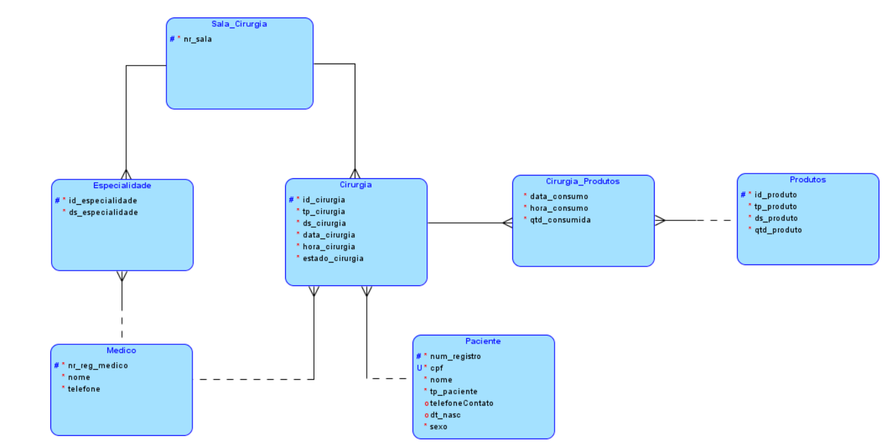
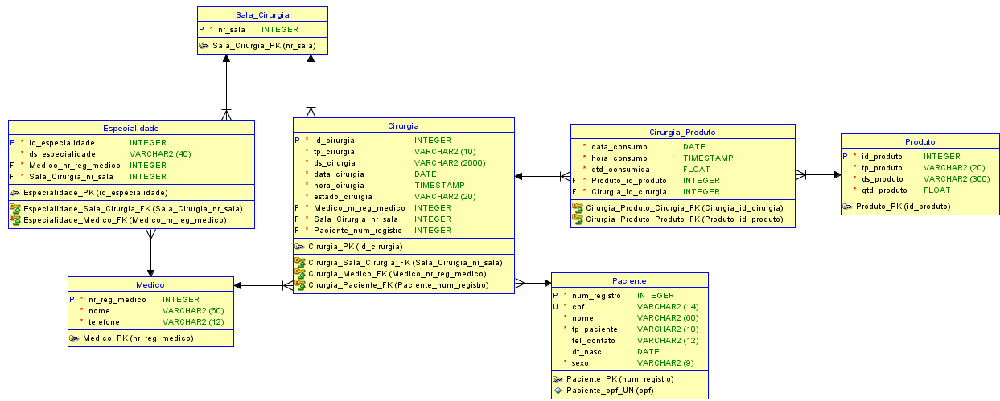

# Centro Cirurgico Ortopédico #

Um hospital investiu parte do seu capital para ampliação e criação de um novo centro cirurgico ortopédico. 

Foram contratados médicos com especialidades em diversas áreas ortopédicas. Cada cirurgia será realizada por um médico que atenda a especialidade requisitada para a realização da cirurgia. Sendo assim, o paciente ao ser recebido no centro cirurgico, será transportado para uma sala de cirurgia preparada de acordo com a cirurgia a ser realizada. Cada sala de cirurgia é equipada com equipamentos especiais para diferentes tipos de cirurgias, e também estará abastecida com os produtos necessários de acordo com a especialidade da cirurgia como medicamentos e suprimentos cirurgicos. É possível que um médico tenha mais de uma especialidade.

Pacientes em situação de emergência ortopédica como entorses, contusōes, fraturas e luxações, serão imediatamente encaminhados para a sala de cirurgia. Se for o caso, a informação deverá ser registrada na cirurgia como emergência. Ao chegar na sala de cirurgia, o médico terá acesso à ficha do paciente com informações como: Nome do paciente, sexo, data de nascimento, tipo de cirurgia, descrição de cirurgia. Cada cirurgia possui data e hora de início. Todos os medicamentos utilizados durante a cirurgia deverão estar registrados no sistema.

Após a cirurgia o paciente será enviado de volta para o hospital. 

## Modelo Lógico ##

## Modelo Relacional ##

## O meu banco de dados deve ser capaz de responder as seguintes perguntas: ##

* Quantos atendimentos o médico já fez?
* Quais tipos de cirurgias que mais ultrapassam o tempo previsto?
* Qual tipo de cirurgia possui o maior numero de incidencias?
* Quais remédios os pacientes mais consumiram para um tipo de cirurgia?
* Quais os remédios mais utilizados para um tipo de cirurgia?
* Qual a quantidade de produtos em estoque?
* Quais produtos em estoque não estão sendo utilizados?
* Quais os produtos em estoque mais utilizados?
* Qual a faixa etária de pacientes possui o maior índice de incidências cirurgicas?

_______________________________________________________________________________________

## Primeira Forma Normal (1NF) ##

A primeira forma normal define que todos os atributos de uma entidade devem ter um único valor. É necessário substituir todos os atributos multivalorados pelos atributos monovalorados que o compõem. Caso um atributo tenha mais de um valor para cada instância de entidade, será necessário criar uma entidade de relacionamento. 

Paciente | Idade | Telefone
--- | --- | --- | 
João | 33| 33642519 |
Maria| 30 | 33642314 |
Maria| 30 | 99978469 |
José| 44 | 33642519 |

## Segunda Forma Normal (2NF) ##

A segunda forma normal determina que cada atributo possua um identificador que não se repita (UID). Para a entidade ser considerada 2NF, ela precisa antes já ser considerada 1NF e todos os atributos da entidade devem depender de um único identificador da entidade.

ID_Produto | Produto |
--- | --- | 
1| Seringa 10ml |
2| Seringa 10ml | 
3| Compressa Gaze 10X10 |

## Terceira Forma Normal (3NF) ##

A regra de 3NF determina que nenhum campo deve ser dependente de outro por qualquer valor que não seja uma chave na tabela. Também é necessário que a forma 2NF seja respeitada para a definição da entidade como 3NF. Se a regra 3NF for alcaçada, a tabela pode-se considerar que a entidade foi normalizada.

